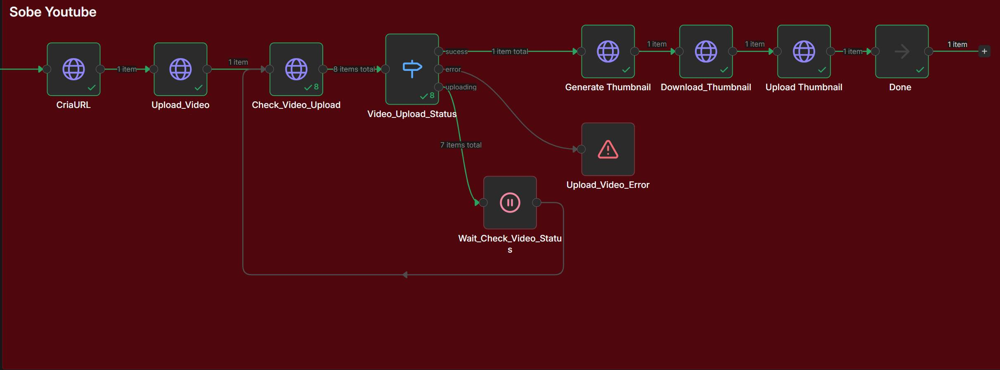

# 🎥 Async YouTube Uploader for n8n 2.x

**Upload large videos (1GB-8GB+) to YouTube from n8n without timeouts or crashes.**

---

## 🚨 The Problem

n8n 2.x removed the `Execute Command` node. Uploading large videos directly causes:

- ❌ Timeout after 5-10 minutes
- ❌ Workflow cancellation
- ❌ Memory overflow
- ❌ Reverse proxy kills the connection

---

## ✅ The Solution

This service uploads videos in the **background**.

1. n8n sends video URL → Gets `jobId` back **instantly**
2. Service uploads in background (no blocking)
3. n8n polls for status until `done`

---

## 🚀 Quick Install

### Option 1: Docker (Easiest)

```bash
cd yt-uploader
docker build -t yt-uploader .
docker run -d -p 3000:3000 --name yt-uploader yt-uploader
```

### Option 2: Node.js

```bash
cd yt-uploader
npm install
node server.js
```

**Done!** Service runs on `http://localhost:3000`

---

## 🔧 Reverse Proxy Setup

### Traefik (Docker Compose)

```yaml
services:
  yt-uploader:
    build: ./yt-uploader
    container_name: yt-uploader
    restart: always
    networks:
      - web
    labels:
      - "traefik.enable=true"
      - "traefik.http.routers.ytuploader.rule=Host(`uploader.yourdomain.com`)"
      - "traefik.http.routers.ytuploader.entrypoints=websecure"
      - "traefik.http.routers.ytuploader.tls.certresolver=letsencrypt"
      - "traefik.http.services.ytuploader.loadbalancer.server.port=3000"

networks:
  web:
    external: true
```

Run: `docker compose up -d`

---

### Nginx

```nginx
server {
    listen 443 ssl;
    server_name uploader.yourdomain.com;

    ssl_certificate /etc/letsencrypt/live/uploader.yourdomain.com/fullchain.pem;
    ssl_certificate_key /etc/letsencrypt/live/uploader.yourdomain.com/privkey.pem;

    location / {
        proxy_pass http://localhost:3000;
        proxy_set_header Host $host;
        proxy_connect_timeout 600s;
        proxy_read_timeout 600s;
        client_max_body_size 0;
    }
}
```

Apply: `sudo nginx -t && sudo systemctl reload nginx`

---

### Apache

```apache
<VirtualHost *:443>
    ServerName uploader.yourdomain.com
    
    SSLEngine on
    SSLCertificateFile /etc/letsencrypt/live/uploader.yourdomain.com/fullchain.pem
    SSLCertificateKeyFile /etc/letsencrypt/live/uploader.yourdomain.com/privkey.pem
    
    ProxyPass / http://localhost:3000/
    ProxyPassReverse / http://localhost:3000/
    ProxyTimeout 600
    LimitRequestBody 0
</VirtualHost>
```

Enable: `sudo a2enmod proxy proxy_http ssl && sudo systemctl reload apache2`

---

## 📡 API Usage

### 1. Start Upload

**Request:**
```bash
curl -X POST http://localhost:3000/upload-start \
  -H "Content-Type: application/json" \
  -d '{
    "videoUrl": "https://example.com/video.mp4",
    "resumableUrl": "https://www.googleapis.com/upload/youtube/v3/videos?uploadType=resumable&upload_id=xyz"
  }'
```

**Response:**
```json
{
  "jobId": "a3f5c9e8-4d2b-4a1c-8f3e-1d7b2c9e4a6f"
}
```

---

### 2. Check Status

**Request:**
```bash
curl http://localhost:3000/upload-status/a3f5c9e8-4d2b-4a1c-8f3e-1d7b2c9e4a6f
```

**Response (Uploading):**
```json
{
  "status": "uploading",
  "progress": 157286400
}
```

**Response (Done):**
```json
{
  "status": "done",
  "videoId": "dQw4w9WgXcQ",
  "youtubeUrl": "https://youtube.com/watch?v=dQw4w9WgXcQ"
}
```

**Response (Error):**
```json
{
  "status": "error",
  "error": "Source video error: 403"
}
```

---

## 🔄 n8n Workflow



### Step 1: Create YouTube Upload URL

**HTTP Request Node:**
- Method: `POST`
- URL: `https://www.googleapis.com/upload/youtube/v3/videos?part=snippet,status&uploadType=resumable`
- Auth: OAuth2 (YouTube credentials)
- Body:
```json
{
  "snippet": {
    "title": "My Video",
    "categoryId": "22"
  },
  "status": {
    "privacyStatus": "private"
  }
}
```

**Save:** `{{ $json.headers.location }}`

---

### Step 2: Start Upload Job

**HTTP Request Node:**
- Method: `POST`
- URL: `http://localhost:3000/upload-start`
- Body:
```json
{
  "videoUrl": "{{ $json.video_url }}",
  "resumableUrl": "{{ $node['Create URL'].json.headers.location }}"
}
```

**Save:** `{{ $json.jobId }}`

---

### Step 3: Poll Status

**Loop (every 30 seconds):**

**HTTP Request Node:**
- Method: `GET`
- URL: `http://localhost:3000/upload-status/{{ $json.jobId }}`

**IF Node:**
- Condition: `{{ $json.status === 'done' }}`
- **True:** Continue workflow
- **False:** Wait 30s, check again

---

## 🐛 Troubleshooting

| Problem | Solution |
|---------|----------|
| `Cannot GET /upload-status` | Check reverse proxy path rewriting |
| `401 YouTube error` | Reconnect OAuth2 in n8n |
| `403 source video` | Make sure video URL is public |
| `Job not found` | Service restarted (jobs are in memory) |
| Timeout errors | Increase proxy timeout (see configs above) |

---

## 📁 Project Structure

```
yt-uploader/
├── server.js              # Main service (already included)
├── package.json           # Dependencies
├── Dockerfile             # Docker build
├── docker-compose.*.yml   # Deploy examples
└── examples/              # More configs & examples
```

---

## 🎯 Status Reference

| Status | Meaning |
|--------|---------|
| `queued` | Job created, waiting |
| `uploading` | Uploading now |
| `done` | ✅ Completed |
| `error` | ❌ Failed |

---

## 📚 More Examples

Check the `examples/` folder for:
- Detailed Nginx configs
- Detailed Apache configs
- More cURL examples
- Systemd service file

---

## ⚡ That's It!

1. Run the service (Docker or Node)
2. Set up reverse proxy (optional)
3. Use in n8n workflow
4. Done!

**Questions?** Check `examples/` folder or open an issue.

---

**Made for the n8n community** ❤️
